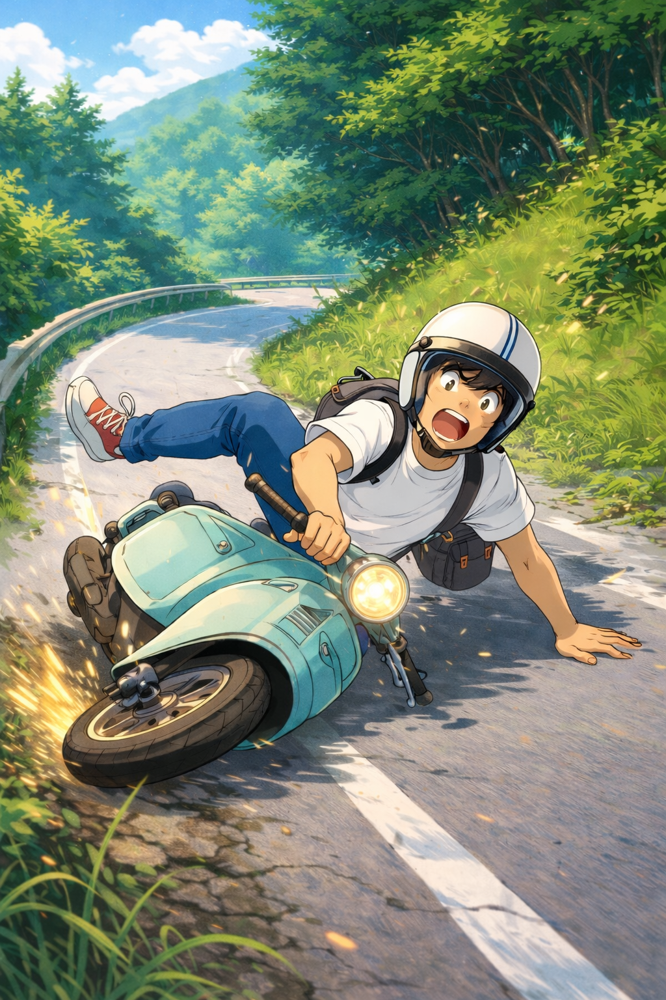
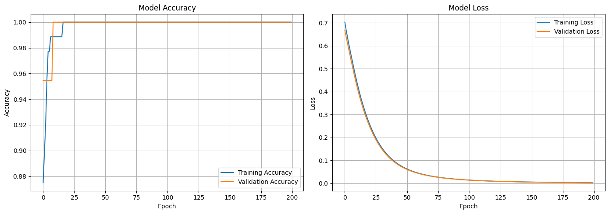

# 🛡️ Guardian Edge: Instant Hazard Alert for Two-Wheelers via NICLA Vision

Guardian Edge is a smart safety system for two-wheeler riders that detects **falls** and **sudden jerks** in real time using **two IMU sources**:  
- An **Arduino Nicla Vision** mounted on the helmet  
- A **smartphone IMU** placed on the rider or vehicle

The goal is to enable **instant hazard alerts** and make everyday rides safer and more intelligent.

---

## 🎯 Motivation

Two-wheeler accidents often involve sudden jerks, skids, or falls where response time is critical.  
Traditional helmets are passive, but with **on-device sensing and ML**, a helmet can actively detect dangerous events and help trigger timely alerts or assistance.

Guardian Edge explores this idea by combining **helmet-mounted IMU data** with **phone IMU data** to understand rider motion more robustly and classify it into safe riding vs. hazardous events.

---

## 🧩 System Overview

The complete pipeline for Guardian Edge consists of:

- Dual IMU data collection (Nicla Vision + smartphone)
- Preprocessing, EDA, and feature engineering
- Training **Decision Tree** and **Neural Network** models
- On-device and offline inference for fall/jerk prediction

### Hardware

- **Arduino Nicla Vision** on the helmet (IMU: accelerometer + gyroscope)
- **Smartphone** (Android) with IMU access (accelerometer + gyroscope)

### Software / Tools

- **Data Processing:** Python, NumPy, Pandas, Matplotlib  
- **ML / Modeling:** Scikit-learn, basic Neural Network framework (e.g., PyTorch / Keras)  
- **Embedded / Deployment:** Arduino IDE, Edge/MCU-friendly deployment flow

---

## 📥 Data Collection

1. Mounted **Nicla Vision** on the helmet and used the onboard IMU to log motion data during rides.
2. Collected **smartphone IMU data** in parallel using a custom/mobile logging setup.  
3. Captured two main scenarios:
   - Normal riding (baseline patterns)
   - Riding with **controlled falls** and **sudden jerks** to simulate real hazards  
4. Synced both streams using timestamps to create a unified dataset with helmet + phone sensor readings per time window.

The collected dataset forms the core of the model’s understanding of what a “safe” vs. “unsafe” motion pattern looks like.

---

## 🔍 EDA & Feature Engineering

After collecting data, several steps were taken to make it ML-ready:

- **Exploratory Data Analysis (EDA):**
  - Visualized raw accelerometer and gyroscope signals for both devices.
  - Observed how patterns differ between normal riding and fall/jerk segments.
  - Identified noise, drift, and outliers to be cleaned or filtered.

- **Preprocessing & Feature Engineering:**
  - Computed derived features such as:
    - Acceleration magnitude
    - Jerk (rate of change of acceleration)
    - Angular velocity patterns
    - Orientation/tilt-related metrics  
  - Created time-windowed features to capture short motion segments rather than isolated samples.
  - Normalized/standardized features where appropriate for stable model training.
 

---

## 🤖 Modeling: Decision Tree & Neural Network

Two main model families were explored:

1. **Decision Tree**
   - Simple, interpretable model.
   - Good for understanding which features (helmet vs. phone signals, jerk magnitude, etc.) contribute most to fall or jerk detection.
   - Useful as a baseline and for quick experimentation.

2. **Neural Network**
   - Able to capture more complex relationships and subtle changes in motion.
   - Better suited for noisy real-world sensor data.
   - Designed as a compact model so it can be adapted for edge deployment.

The models were trained to classify segments into categories such as:
- Normal riding
- Fall
- Sudden jerk / hazard

Training involved splitting the data into training and test sets, tuning basic hyperparameters, and comparing metrics like accuracy and confusion matrices to choose the better-performing configuration.

---

## 🏃 Training & Inference Flow

- **Training (Offline):**
  - Run on a laptop/desktop using Python.
  - Uses the processed dual-IMU dataset.
  - Exports trained Decision Tree and Neural Network models.
 

- **Inference:**
  - Offline testing: Run model predictions on recorded data to validate performance.
  - Edge-oriented workflow:
    - Use Nicla Vision IMU stream as primary input.
    - Optionally fuse or approximate phone IMU features depending on deployment constraints.
    - Run lightweight inference to flag potential falls or jerks.

Future iterations can move more of the logic fully onto the embedded device or a phone app for **live alerts** (sound, vibration, or network notifications).

---

## 🧪 Current Status

- Dual IMU dataset collected for:
  - Normal riding
  - Falls during riding
  - Sudden jerks
- EDA and feature engineering completed for core motion features.
- Decision Tree and Neural Network models trained and evaluated.
- Inference pipeline established for classifying motion segments into safe vs. hazardous events.

## 🔮 Future Work

Planned improvements and extensions:

- Add **GPS integration** for automatic sharing of location during detected fall events. 
- Integrate a **real-time alert mechanism** (buzzer, LED, or phone notification) directly with the Nicla Vision and/or mobile app. 
- Optimize and quantize the neural model for **ultra-low-latency inference** on microcontrollers.
- Collect more diverse ride data: different riders, road types, speeds, and phone placements to improve generalization.

---

## 👨‍💻 Contributors

- **Manas Kumar Mishra** 
- **Adarsh Dubey** 
- **Animesh Kumar** 
- **Abhijeet Kumar** 
- **Varshan P A** 
---

> *Guardian Edge — because safety should always ride with you.*

> *Guardian Edge — turning helmets into active guardians, not just passive gear.*
